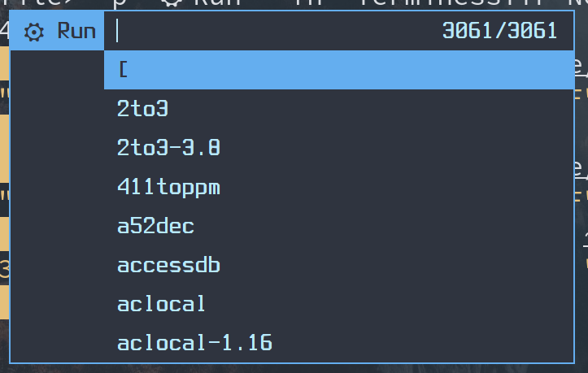

# Patched dmenu for myself

Go to [patches.md](./patches/patches.md) to get patches descriptions.

## Screenshots

```shell
$ dmenu_run -i -F -h 48 -H <history file> -p "⚙ Run" -fn "TerminessTTF Nerd Font Mono:style=Bold:pixelsize=32" -nf "#b7e8fb" -nb "#2F343F" -sf "#2F343F" -sb "#64aeef"
```


```shell
$ dmenu_run -i -F -h 48 -l 8 -c -H <history file> -p "⚙ Run" -fn "TerminessTTF Nerd Font Mono:style=Bold:pixelsize=32" -nf "#b7e8fb" -nb "#2F343F" -sf "#2F343F" -sb "#64aeef"
```


