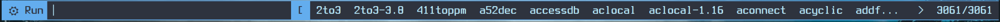

# Patched dmenu for myself

Go to [patches.md](./patches/patches.md) to get patches descriptions.

## Screenshots

Configs: `.Xresources`

```shell
! Configs for dmenu
dmenu.font: xft:TerminessTTF Nerd Font Mono:style=Bold:pixelsize=32
dmenu.background: #2F343F
dmenu.foreground: #b7e8fb
dmenu.selbackground: #64aeef
dmenu.selforeground: #2F343F
```

```shell
$ dmenu_run -i -F -h 48 -H <history file> -p "⚙ Run"
```



```shell
$ dmenu_run -i -F -h 48 -l 8 -c -H <history file> -p "⚙ Run"
```


